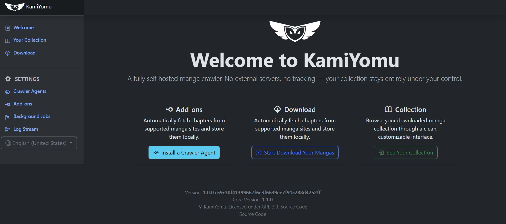

# KamiYomu — Your Self-Hosted Manga Crawler


**KamiYomu** is a powerful, extensible manga crawler built for manga enthusiasts who want full control over their collection. It scans and downloads manga from supported websites, stores them locally, and lets you host your own private manga reader—no ads, no subscriptions, no limits.

---

## ✨ Features

- 🔍 **Automated Crawling**  
  Fetch chapters from supported manga sites with ease.

- 💾 **Local Storage**  
  Keep your manga files on your own server or device.

- 🧩 **Plugin Architecture**  
  Add support for new sources or customize crawling logic.

- 🛠️ **Built with .NET Razor Pages**  
  Lightweight, maintainable, and easy to extend.

---

## 🚀 Why KamiYomu?

Whether you're cataloging rare series, powering a personal manga dashboard, or seeking a cleaner alternative to bloated online readers, KamiYomu puts you in control of how you access and organize manga content. It’s a lightweight, developer-friendly crawler built for clarity, extensibility, and respectful use of publicly accessible sources. Content availability and usage rights depend on the licensing terms of each source — KamiYomu simply provides the tools.
 
 <br/>
 
 <br/>

## Requirements

- [Docker](https://www.docker.com/get-started)


## 📦 Getting Started

save the following `docker-compose.yml` file to run KamiYomu with Docker:

```yml
services:
  kamiyomu:
    image: marcoscostadev/kamiyomu:latest # Check releases for latest versions
    ports:
      - "8080:8080" # HTTP Port
    restart: unless-stopped
    healthcheck:
      test: ["CMD", "curl", "-f", "http://localhost:8080/healthz"]
      interval: 30s
      timeout: 10s
      retries: 3
    volumes:
      - ./AppData/manga:/manga # Your desired local path for manga storage
```

In the folder where you saved the `docker-compose.yml` file, run:

```bash
    docker-compose up -d
```
You will have access to the web interface at `http://localhost:8080`.
Keep in mind to map the volumes to your desired local paths. 
See the releases branchs for identifying the versions available.

Configure your sources and crawler agents 

Download crawler agents from NuGet Package from [here](https://github.com/orgs/KamiYomu/packages) and upload them in [Crawler Agents](http://localhost:8080/Settings/CrawlerAgents).


### Using Visual Studio

## 🧩 Create your First Crawler Agent


```csharp

/// <summary>
/// Defines a contract for manga crawling agents that support search, retrieval, and metadata extraction.
/// </summary>
public interface ICrawlerAgent : IDisposable
{
    /// <summary>
    /// Asynchronously retrieves the favicon URI associated with the crawler's target site.
    /// </summary>
    /// <param name="cancellationToken">Optional token to cancel the operation.</param>
    /// <returns>A <see cref="Task{Uri}"/> representing the favicon location.</returns>
    Task<Uri> GetFaviconAsync(CancellationToken cancellationToken);

    /// <summary>
    /// Searches for manga titles matching the specified name, using either traditional pagination or a continuation token.
    /// </summary>
    /// <param name="titleName">The title or keyword to search for.</param>
    /// <param name="paginationOptions">Pagination parameters, supporting both page-based and continuation token-based pagination.</param>
    /// <param name="cancellationToken">Optional token to cancel the operation.</param>
    /// <returns>A paged result containing a collection of matching <see cref="Manga"/> entries.</returns>
    Task<PagedResult<Manga>> SearchAsync(string titleName, PaginationOptions paginationOptions, CancellationToken cancellationToken);

    /// <summary>
    /// Retrieves detailed information about a specific manga by its unique identifier.
    /// </summary>
    /// <param name="id">The unique ID of the manga.</param>
    /// <param name="cancellationToken">Optional token to cancel the operation.</param>
    /// <returns>A <see cref="Task{Manga}"/> containing the manga details.</returns>
    Task<Manga> GetByIdAsync(string id, CancellationToken cancellationToken);

    /// <summary>
    /// Retrieves a paged list of chapters for the specified manga.
    /// </summary>
    /// <param name="manga">The manga object.</param>
    /// <param name="paginationOptions">Pagination parameters, supporting both page-based and continuation token-based pagination.</param>
    /// <returns>A paged result containing a collection of <see cref="Chapter"/> entries.</returns>
    Task<PagedResult<Chapter>> GetChaptersAsync(Manga manga, PaginationOptions paginationOptions, CancellationToken cancellationToken);
    /// <summary>
    /// Retrieves the list of page images associated with a given manga chapter.
    /// </summary>
    /// <param name="chapter">The chapter entity containing metadata and identifiers.</param>
    /// <param name="cancellationToken">Optional token to cancel the operation.</param>
    /// <returns>A collection of <see cref="Page"/> objects representing individual chapter pages.</returns>
    Task<IEnumerable<Page>> GetChapterPagesAsync(Chapter chapter, CancellationToken cancellationToken);
}
```
1. **Build the Project**: Compile your project to generate the DLL file.
1. **Deploy the Crawler Agent**: Upload the compiled DLL to the KamiYomu web interface under the "Crawler Agents" section. Or publish the package in NuGet.Org
1. **Configure and Use**: Once uploaded, configure the crawler agent in KamiYomu and start crawling manga from the supported source.

Do you want a reference implementation? Check:
- [KamiYomu.CrawlerAgents.MangaDex](https://github.com/KamiYomu/KamiYomu.CrawlerAgents.MangaDex) if you crawler will consume a web api.
- [KamiYomu.CrawlerAgents.MangaKatana](https://github.com/KamiYomu/KamiYomu.CrawlerAgents.MangaKatana)  if you crawler will consume a web page.
- [KamiYomu.CrawlerAgents.MangaFire](https://github.com/KamiYomu/KamiYomu.CrawlerAgents.MangaFire)  another example to consume a web page.
> NOTE: Make sure to use a Validator console app to ensure your crawler agent meets all requirements before deploying it to KamiYomu.


Consider using this `<PropertyGroup>` in your csproj, adjust the title accorgly

```xml
	<PropertyGroup>
		<Title>My Crawler Agent</Title>
		<Description>A dedicated crawler agent for accessing public data from My Personal Stuff. Built on KamiYomu.CrawlerAgents.Core, it enables efficient search, metadata extraction, and integration with the KamiYomu platform.</Description>
		<Authors>MyName</Authors>
		<Owners>MyName</Owners>
		<PackageProjectUrl>https://github.com/MyProjectUrl</PackageProjectUrl>
		<RepositoryUrl>https://github.com/MyRepositoryUrl</RepositoryUrl>
		<RepositoryType>git</RepositoryType>
		<PackageTags>kamiyomu-crawler-agents;manga-download</PackageTags>
		<PackageLicenseExpression>GPL-3.0-only</PackageLicenseExpression>
		<Copyright>© Personal. Licensed under GPL-3.0.</Copyright>
		<PackageIconUrl>https://raw.githubusercontent.com/MyPackageLogoUrl</PackageIconUrl>
		<PackageIcon>Resources/logo.png</PackageIcon>
		<PackageReadmeFile>README.md</PackageReadmeFile>
	</PropertyGroup>
```

The Package Tag `<PackageTags>kamiyomu-crawler-agents</PackageTags>` is required to be showed in KamiYomu add-ons
See the existing projects to use as a reference for your csproj.

## Debugging Your NuGet Package in KamiYomu

This guide explains how to build, import, and debug a NuGet package for use in KamiYomu.

---

### 1. Configure Your Project

Add the following snippet to your `.csproj` file.  
This ensures that a NuGet package is generated during the **Debug** build:

```xml
<PropertyGroup Condition="'$(Configuration)' == 'Debug'">
  <GeneratePackageOnBuild>True</GeneratePackageOnBuild>
  <IncludeSymbols>True</IncludeSymbols>
  <IncludeSource>True</IncludeSource>
  <SymbolPackageFormat>snupkg</SymbolPackageFormat>
</PropertyGroup>
```

### 2. Build the Project

Run a build in **Debug** mode.  
The generated NuGet package (.nupkg) and symbol file (.pdb) will be located in:

### 3. Import the Package into KamiYomu

1. Open KamiYomu.
2. Navigate to **Crawler Agents** in the menu.
3. Import your NuGet package (.nupkg) from the bin/Debug folder.

### 4. Copy the Symbol File

Copy the .pdb file from your bin/Debug folder into:

`src\AppData\agents\{your-crawler}\lib\net8.0`

This allows Visual Studio to map your source code during debugging.

### 5. Debugging in KamiYomu

KamiYomu uses a decorator class to invoke agent methods:

`src\KamiYomu.Web\Entities\CrawlerAgentDecorator.cs`

- Set a breakpoint in any call within this class.
- When Visual Studio hits the breakpoint, step into the call.
- Your agent’s source code will be displayed and debuggable.

## 🧠 Tech Stack- .NET 8 Razor Pages
- Hangfire for job scheduling
- LiteDB for lightweight persistence
- HTMX + Bootstrap for dynamic UI
- Plugin-based architecture for source extensibility

## 📜 License
This project is licensed under AGPL-3.0. See the LICENSE file for details.

## 🤝 Contributing
Pull requests are welcome! If you have ideas for new features, plugin sources, or UI improvements, feel free to open an issue or submit a PR.

## 💬 Contact
Questions, feedback, or bug reports? Reach out via GitHub Issues or start a discussion.