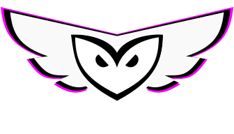
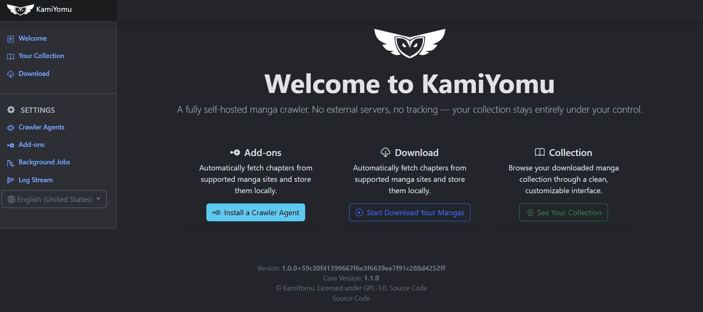

# KamiYomu — A self-hosted, extensible manga reader and download tool

**KamiYomu** is a high-performance, extensible manga manager designed for enthusiasts who demand total control. 

By leveraging a modular **Crawler Agent** architecture, KamiYomu empowers you to discover, download, reading, and archive manga from any supported source into a private, self-hosted library.

> [!NOTE]
> **Total Extensibility:** If a site isn't supported yet, you can build your own Crawler Agent in C# and integrate it instantly.

### 🚀 Core Capabilities
* **Modular Crawling:** Support for any website via community-driven **Crawler Agents**.
* **Local Archival:** Download and store high-quality images in a structured local library.
* **Private Hosting:** A built-in web reader to access your collection from any device, anywhere.
* **Developer Friendly:** Comprehensive SDK and Validator tools for building custom agents.
[📖 Read the docs](https://kamiyomu.github.io)

---

---

# 🤝 Join the KamiYomu Community

KamiYomu is built by people who care about great tooling for managing manga. Get involved — your feedback, bug reports, and contributions help shape the project.

| Action | Link |
| :--- | :--- |
| **Discord** |  |
| **Report** |  |
| **Contribute** |  |
| **Sponsor** |  |

---

## 🌐 Community Crawler Agents

KamiYomu's extensibility shines through **community-driven Crawler Agents**. These are custom modules built by talented developers that extend KamiYomu's support to additional manga sources beyond the core implementation.

### 📦 Available Agents

The community has already created some fantastic crawler agents! Below is a curated list of verified agents available on NuGet:

| Crawler Agent | Source | Maintainer | Tags |
| :--- | :--- | :--- | :--- |
| [Piman.CrawlerAgents.MangaFire](https://www.nuget.org/packages/Piman.CrawlerAgents.MangaFire) | [GitHub](https://github.com/piman13/Piman.CrawlerAgents.MangaFire) | [@Piman](https://github.com/piman13) | `manga-fire` |
| [Piman.CrawlerAgents.MangaKatana](https://www.nuget.org/packages/Piman.CrawlerAgents.MangaKatana) | [GitHub](https://github.com/piman13/Piman.CrawlerAgents.MangaKatana) | [@Piman](https://github.com/piman13) | `manga-katana` |

> **🔍 Discover More:** Browse the complete list of community agents on [NuGet](https://www.nuget.org/packages?q=Tags%3A%22kamiyomu-crawler-agents%22).

--- 

## 🚀 Build Your Own Agent

Have a manga source you'd like to support? **You can build your own Crawler Agent in C#!**

**Getting Started:**
1. 📖 Read the [Crawler Agent Development Guide](https://kamiyomu.com/docs/crawler-agents/create/)
2. 💻 Use the provided SDK and templates to jumpstart development
3. 🧪 Leverage the Validator tools to test your implementation
4. 📦 Publish to NuGet with the `kamiyomu-crawler-agents` tag
5. 🎉 Share your agent with the community—we'll add it to this list!

## ✨ Why Contribute?

- **Zero Barriers:** Our SDK makes it simple to add support for any website
- **Your Community:** Directly impact how manga enthusiasts access content
- **Maintenance:** Your agent runs locally—no central server dependencies
- **Recognition:** Get featured in our official documentation and README

---

**Questions?** Join our [Discord community](https://discord.gg/b9zwEEejsJ) or [open an issue](https://github.com/KamiYomu/KamiYomu/issues) on GitHub!

---

# 🚀 Why KamiYomu?

Whether you're cataloging rare series, powering a personal manga dashboard, or seeking a cleaner alternative to bloated online readers, KamiYomu puts you in control. It's a lightweight, developer-friendly crawler built for clarity, extensibility, and respectful use of publicly accessible sources.

# 📦 Getting Started

KamiYomu supports Docker, Windows, and Linux installations. For detailed instructions, see theinstallation guides:.

- [Docker](https://kamiyomu.com/docs/Installation/Install-via-docker/)
- [Windows](https://kamiyomu.com/docs/Installation/install-via-windows/)
- [Linux](https://kamiyomu.com/docs/Installation/install-via-linux/)

# 🌐 Public API & OPDS Catalog

KamiYomu provides external access to your collection via a public API and the OPDS (Open Publication Distribution System) standard.

## 📚 OPDS Catalog
To access your library on mobile devices, e-readers, or third-party apps (like Moon+ Reader or KyBook), use the following endpoint:

`http://localhost:8080/public/api/v1/opds`

**Note:** If accessing from a different device, replace `localhost` with your server's local IP address (e.g., `192.168.1.50`).

---

## 🛠 Interactive API Documentation (Swagger)

For developers or users wishing to interact with the system programmatically, a full Swagger UI is available to explore all endpoints:

`http://localhost:8080/public/api/swagger/index.html`

---

## ⚠️ Network Configuration
To access these services from outside the host machine:
* **Firewall:** Ensure that port `8080` (or your custom mapped port) is open in your system's firewall.
* **Remote Access:** If accessing over the internet, ensure you have configured port forwarding or a reverse proxy. 
* **Security:** It is highly recommended to use a VPN or a reverse proxy with SSL (HTTPS) if exposing these endpoints publicly.

> [!NOTE]
> Map volumes to local paths as needed. Check [releases](https://github.com/KamiYomu/KamiYomu/releases) for available versions.

# 🧠 Tech Stack

- .NET 8 Razor Pages
- Hangfire for job scheduling
- LiteDB for lightweight persistence
- HTMX + Bootstrap for dynamic UI
- Plugin-based architecture for extensibility

----

# ⚠️ Capabilities & Limitations

## ✅ What KamiYomu Does

* **Complete Manga Reader:** Features a full suite of tools including advanced filtering, reading history, "Chapters of the Week," and dedicated views for new chapters and fresh manga releases.
* **Browser-Based Crawling:** Operates crawler agents that act like a standard web browser to navigate sites, execute JavaScript, and interact with content naturally.
* **Task Orchestration:** Schedules and manages agent tasks such as searching, listing, and fetching metadata.
* **Image Acquisition:** Downloads images directly from sources identified by the crawler agents.
* **Local Archiving:** Automatically organizes downloaded images into structured archives within your specified directories.
* **Flexible Exporting:** Allows you to export your collection as PDF, CBZ, or ZIP files for offline use.
* **Library Management:** Provides a sleek, self-hosted web interface optimized for both desktop and mobile browsing.

---

## ❌ What KamiYomu Does Not

**Security & Data Integrity**
* **Exploit or Invade:** Never bypasses security measures, exploits vulnerabilities, or circumvents paywalls/access controls.
* **Extract Private Data:** Does not scrape databases, protected information, login credentials, or API keys.
* **Data Collection:** Does not collect, monitor, or store any personal data, metadata, or activity on central servers.

**Content & Distribution**
* **Provide Content:** Does not include, host, or serve any built-in manga content. Users must source their own material.
* **Peer-to-Peer Sharing:** Does not support P2P sharing, inter-instance communication, or commercial redistribution.
* **Content Persistence:** Does not cache or retain content on KamiYomu servers; all data exists strictly on the user's local storage.

**Legal & Liability**
* **Endorsement:** Does not support, condone, or assist in bypassing legal restrictions or copyright infringement.
* **Compliance Guarantee:** Does not ensure compliance with third-party Terms of Service or local laws; this is the sole responsibility of the user.
* **Professional Services:** Does not offer legal advice, official support for third-party sites, or warranties regarding software reliability.

---

## ⚖️ User Responsibility & Disclaimer

**KamiYomu is provided "as-is" for local, personal use only.** By using this software, you acknowledge that you are solely responsible for the content you access and how you manage it. The developers and maintainers of KamiYomu assume **no liability** for:
1. User compliance with copyright laws or licensing agreements.
2. Violations of the Terms of Service of any source websites.
3. Any legal consequences arising from the use or misuse of this tool.

Users are encouraged to use KamiYomu only with content they have the legal right to access.

# 📃 License

The KamiYomu project is licensed under the **AGPL-3.0 (Affero General Public License version 3.0)**. This license allows users to freely use, modify, and distribute the software, provided that any modified versions are also distributed under the same license. 

## Key Points of AGPL-3.0:
- **Freedom to Use**: Users can run the software for any purpose.
- **Freedom to Study and Modify**: Users can access the source code and modify it to suit their needs.
- **Freedom to Distribute Copies**: Users can share the original software with others.
- **Freedom to Distribute Modified Versions**: Users can distribute modified versions of the software, but they must also be licensed under AGPL-3.0, ensuring that the same freedoms are preserved for all users.
---

# 🤝 Contributing

Pull requests are welcome! See the [development guide](https://kamiyomu.github.io/docs/development/development/) to get started cloning the project and running it in Visual Studio or VS Code.

Create your own crawler agents by following the [Crawler Agent development guide](https://kamiyomu.com/docs/crawler-agents/create/).

# 💬 Contact

Questions, feedback, or bug reports? [Open an issue](https://github.com/KamiYomu/issues) or Join the discord .